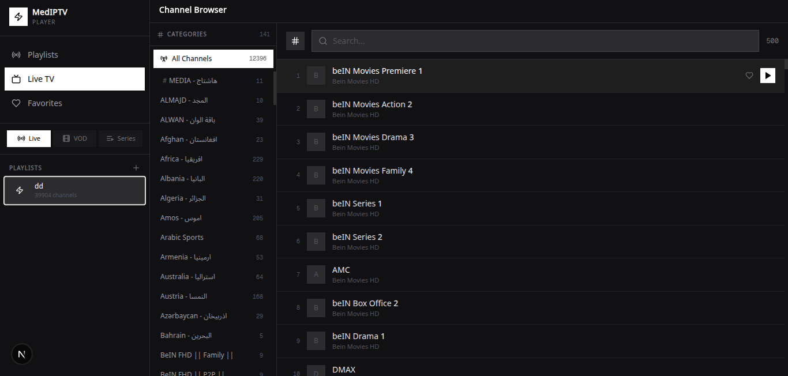
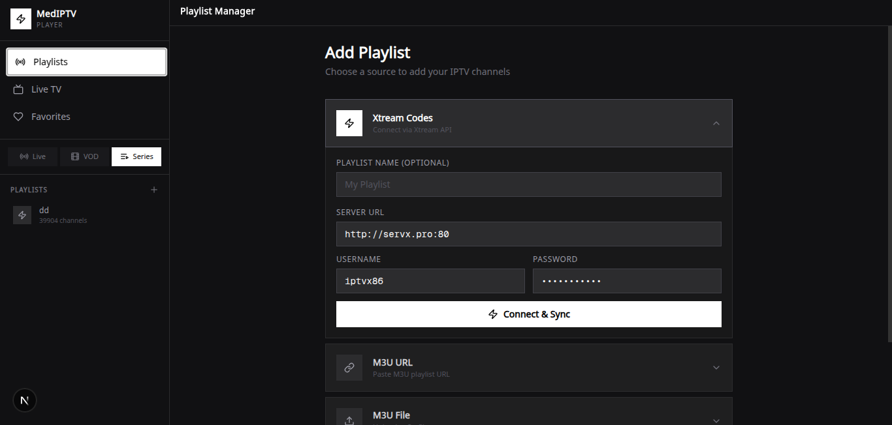
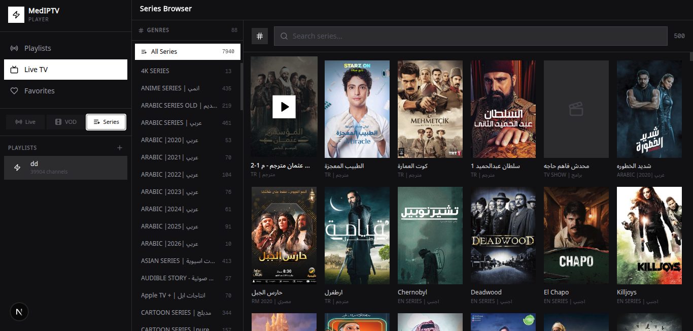
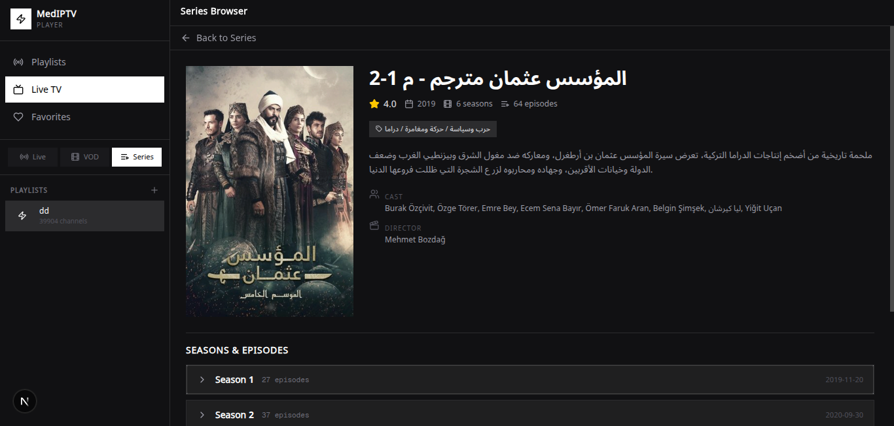
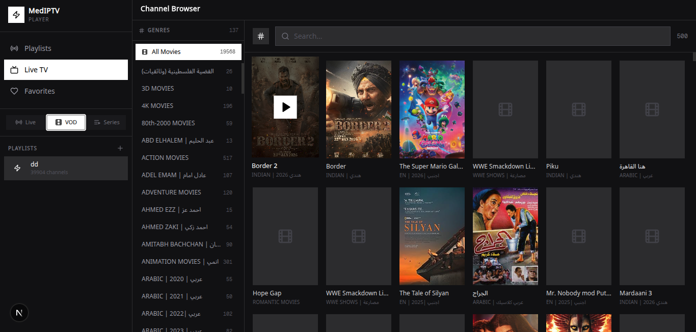
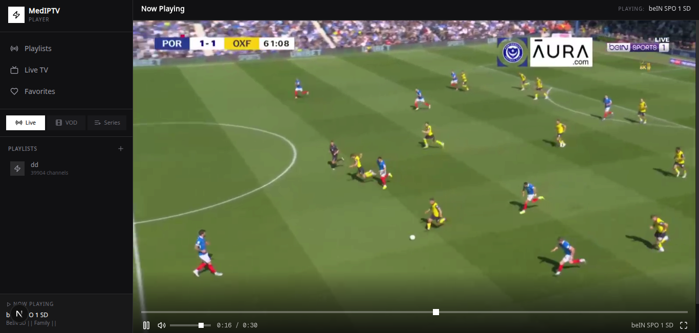

# IPTV Player

A modern IPTV player application built with Next.js, Tailwind CSS, and Shadcn UI. This application allows users to stream live TV channels, series, movies, and manage playlists with a clean and responsive interface.

## Features

- 📺 Live TV channel streaming
- 🎬 Series and movie (VOD) library
- 📋 Playlist management
- 🔍 Search and filtering capabilities
- 📱 Responsive design for mobile and desktop
- 🎨 Modern UI with Tailwind CSS and Shadcn components
- ▶️ Video playback with HLS.js support
- 🔐 User authentication (via NextAuth)
- 🌐 Internationalization support (next-intl)

## Screenshots

### Channels View


### Playlist Management


### Series Library


### Series Detail View


### VOD (Movies) Library


### Player



## Technology Stack

- **Framework:** [Next.js](https://nextjs.org/) 16.1.1
- **Styling:** [Tailwind CSS](https://tailwindcss.com/) 4
- **UI Components:** [Shadcn UI](https://ui.shadcn.com/) with Radix UI primitives
- **Type Safety:** [TypeScript](https://www.typescriptlang.org/) 5
- **State Management:** [Zustand](https://zustand-demo.pmndrs.com/) 5.0.6
- **Server State:** [React Query](https://tanstack.com/query/v5) 5.82.0
- **Forms:** [React Hook Form](https://react-hook-form.com/) 7.60.0 with [Zod](https://zod.dev/) 4.0.2
- **Video Playback:** [video.js](https://videojs.com/) 8.23.7 with [HLS.js](https://hls.js.org/) 1.6.15
- **Authentication:** [NextAuth.js](https://next-auth.js.org/) 4.24.11
- **Internationalization:** [next-intl](https://next-intl.vercel.app/) 4.3.4
- **Database:** [Prisma](https://www.prisma.io/) 6.11.1 (ORM)
- **Icons:** [Lucide React](https://lucide.dev/) 0.525.0
- **Notifications:** [Sonner](https://sonner.emilkowal.ski/) 2.0.6
- **Drag & Drop:** [@dnd-kit](https://dndkit.com/) 6.3.1
- **Rich Text Editor:** [@mdxeditor/editor](https://www.mdxeditor.com/) 3.39.1

## Getting Started

### Prerequisites

- [Bun](https://bun.sh/) (or npm/yarn/pnpm)
- [PostgreSQL](https://www.postgresql.org/) (or adjust prisma schema for your database)

### Installation

1. Clone the repository:
   ```bash
   git clone https://github.com/yourusername/iptv_player_byme.git
   cd iptv_player_byme
   ```

2. Install dependencies:
   ```bash
   bun install
   # or
   npm install
   ```

3. Set up environment variables:
   ```bash
   cp .env.example .env
   # Edit .env with your configuration
   ```

4. Initialize the database:
   ```bash
   bun run db:generate
   bun run db:migrate
   ```

### Development

Start the development server:
```bash
bun run dev
# or
npm run dev
```

The application will be available at `http://localhost:3000`.

### Production Build

Build the application:
```bash
bun run build
```

Start the production server:
```bash
bun run start
```

## Project Structure

```
├── src/
│   ├── app/                 # Next.js app directory
│   ├── components/          # Reusable components
│   ├── lib/                 # Utility functions and libraries
│   ├── types/               # TypeScript type definitions
│   └── styles/              # Global styles
├── public/                  # Static assets
├── screenshots/             # Screenshots for README
├── prisma/                  # Database schema and migrations
├── .next/                   # Next.js build output
├── node_modules/            # Dependencies
├── package.json             # Project dependencies and scripts
└── README.md                # This file
```

## Available Scripts

- `bun run dev` - Start development server
- `bun run build` - Build for production
- `bun run start` - Start production server
- `bun run lint` - Run ESLint
- `bun run db:push` - Push Prisma schema to database
- `bun run db:generate` - Generate Prisma client
- `bun run db:migrate` - Run Prisma migrations
- `bun run db:reset` - Reset database

## Contributing

Contributions are welcome! Please feel free to submit a Pull Request.

1. Fork the repository
2. Create your feature branch (`git checkout -b feature/AmazingFeature`)
3. Commit your changes (`git commit -m 'Add some AmazingFeature'`)
4. Push to the branch (`git push origin feature/AmazingFeature`)
5. Open a Pull Request

## License

This project is licensed under the MIT License - see the [LICENSE](LICENSE) file for details.

## Acknowledgments

- [Next.js Team](https://nextjs.org/)
- [Tailwind CSS Team](https://tailwindcss.com/)
- [Shadcn UI Team](https://ui.shadcn.com/)
- [Video.js Community](https://videojs.com/)
- [HLS.js Contributors](https://github.com/video-dev/hls.js)
- [Prisma Team](https://www.prisma.io/)
